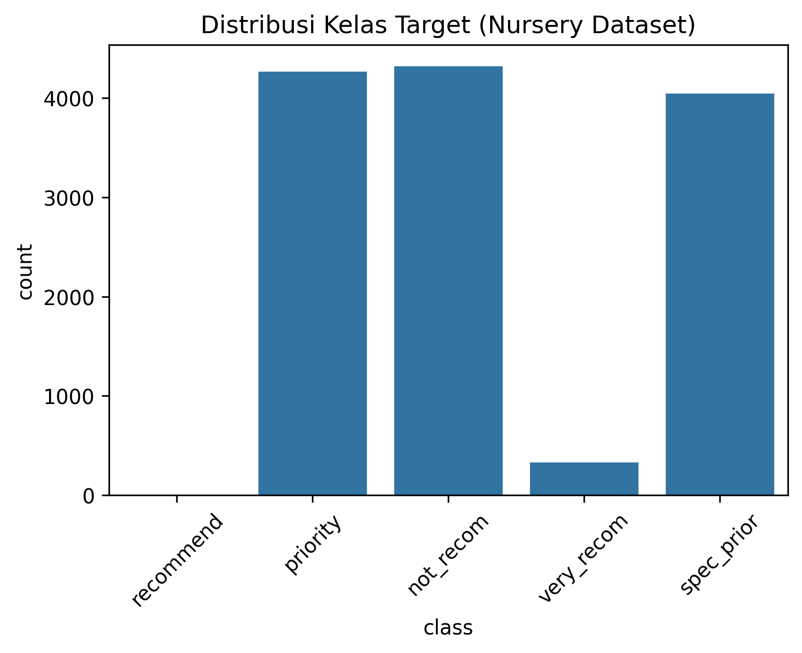
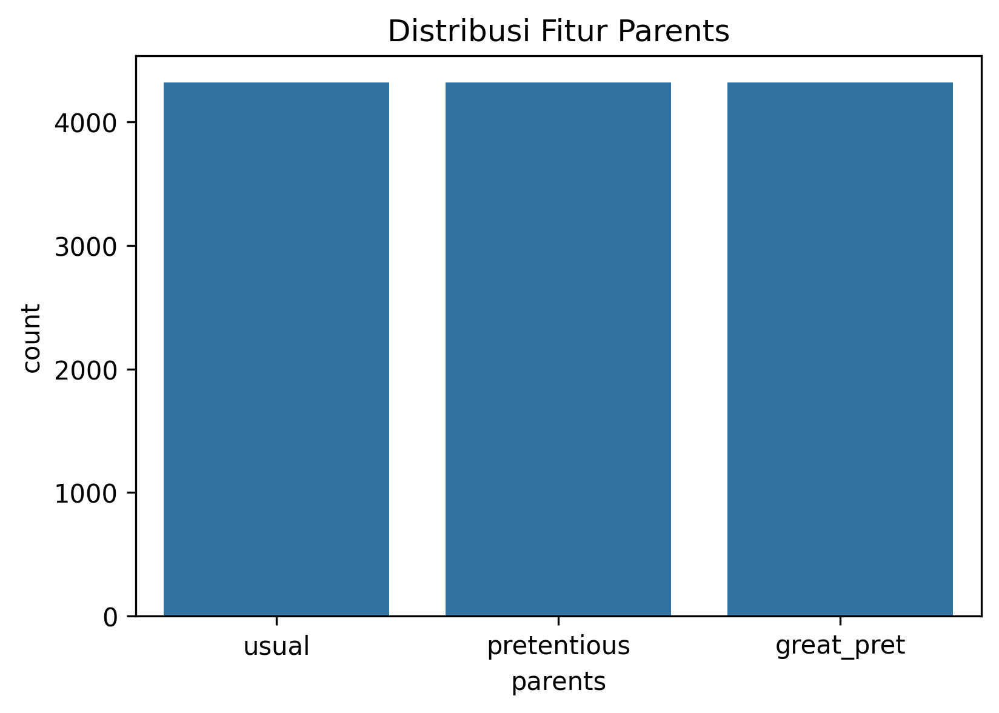
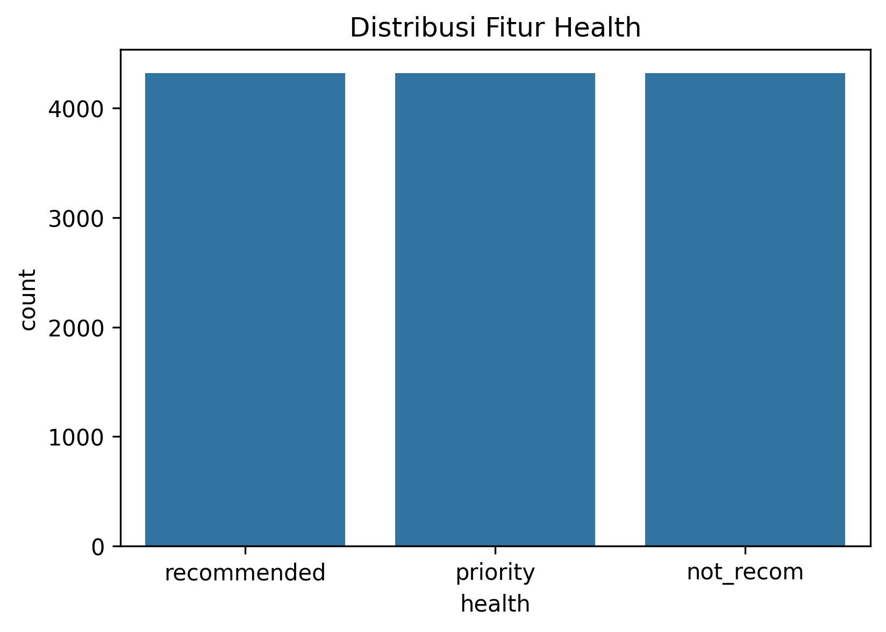
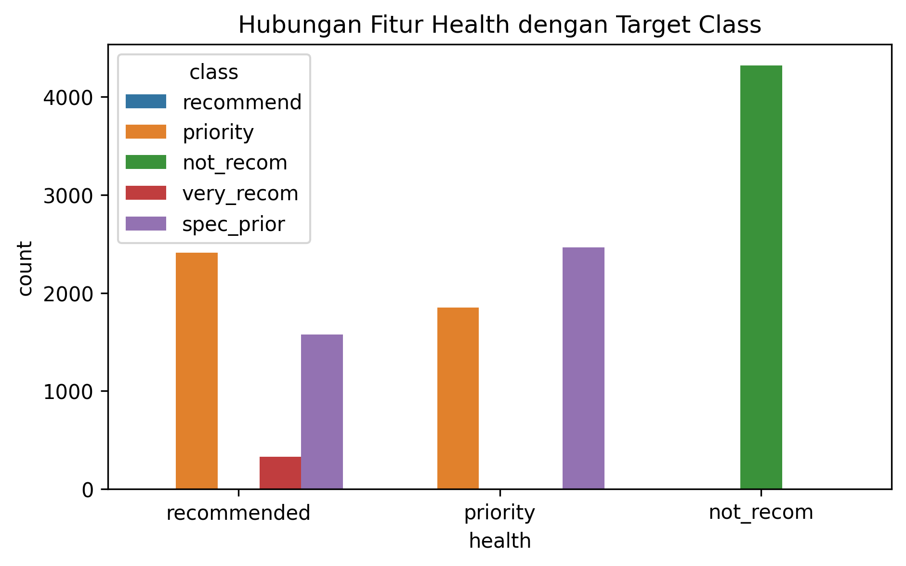
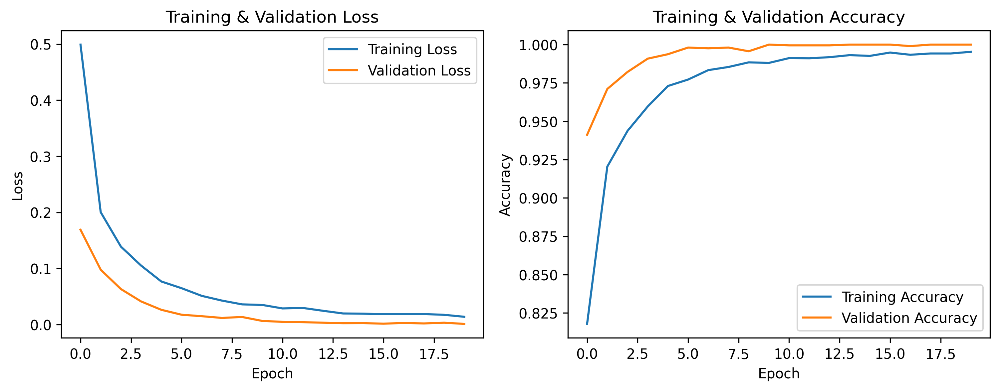
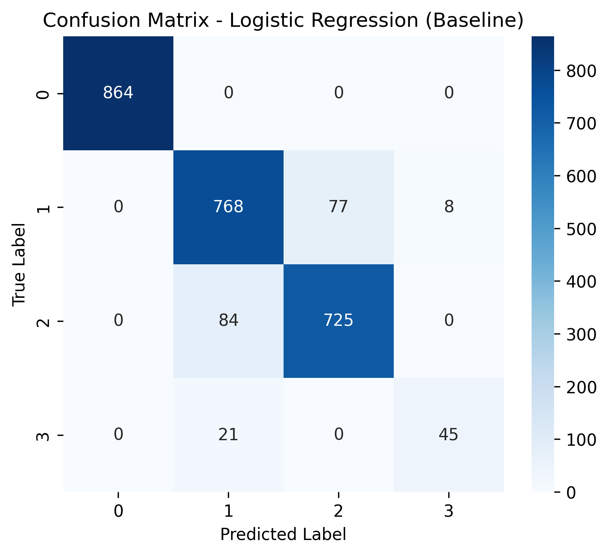
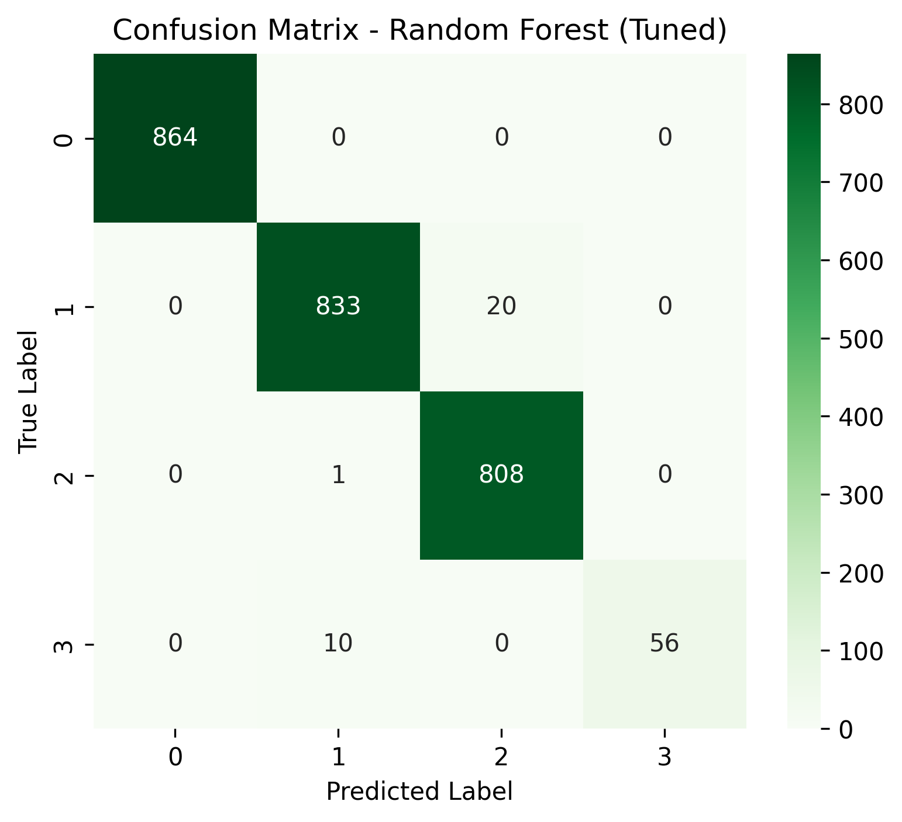
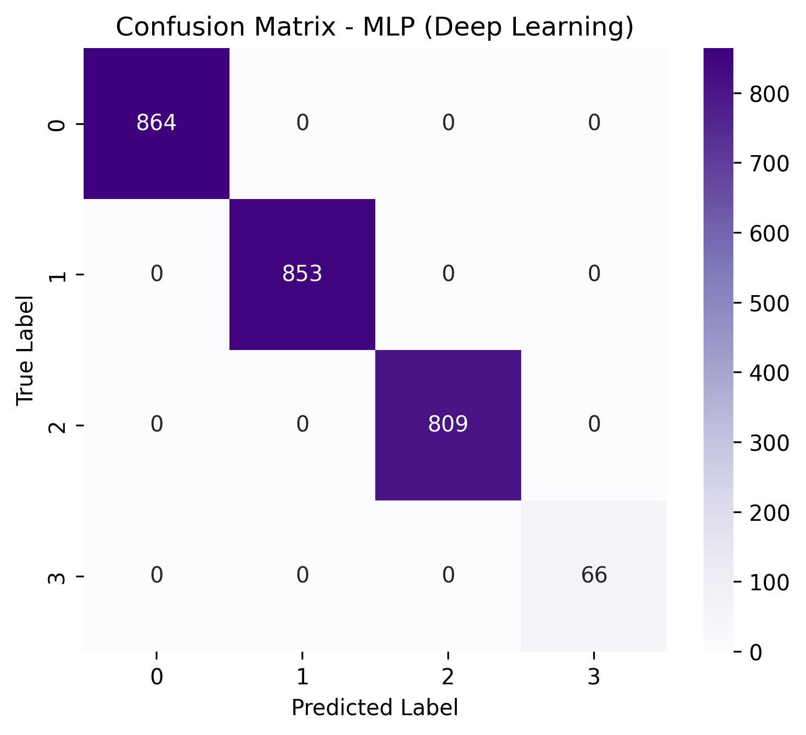

## INFORMASI PROYEK

**Judul Proyek:**  
Klasifikasi Kelayakan Penerimaan Anak di Nursery Menggunakan Machine Learning dan Deep Learning

**Nama Mahasiswa:** Haris Cahyana  
**NIM:** 233307050  
**Program Studi:** Teknologi Informasi  
**Mata Kuliah:** Data Science  
**Dosen Pengampu:** Gus Nanang Syaifuddiin, S.Kom.,M.Kom.  
**Tahun Akademik:** 2025/5
**Link GitHub Repository:** [\[URL GitHub\]](https://github.com/HrsCode11/UAS-Data-Science.git)  
**Link Video Pembahasan:** [\[URL Video\]](https://youtu.be/K8jEg3w__GI)

---

## 1. LEARNING OUTCOMES

Pada proyek ini, mahasiswa diharapkan dapat:

1. Memahami konteks masalah dan merumuskan problem statement secara jelas.
2. Melakukan analisis dan eksplorasi data (EDA) secara komprehensif.
3. Melakukan data preparation yang sesuai dengan karakteristik dataset.
4. Mengembangkan tiga model machine learning yang terdiri dari model baseline, model machine learning lanjutan, dan model deep learning.
5. Menggunakan metrik evaluasi yang relevan dengan tugas klasifikasi.
6. Melaporkan hasil eksperimen secara ilmiah dan sistematis.
7. Mengunggah seluruh kode proyek ke GitHub.
8. Menerapkan prinsip reproducibility dan software engineering.

---

## 2. PROJECT OVERVIEW

### 2.1 Latar Belakang

Proses penerimaan anak di institusi nursery melibatkan berbagai aspek sosial, ekonomi, dan kesehatan keluarga. Proses seleksi yang dilakukan secara manual berpotensi menimbulkan subjektivitas dan inkonsistensi dalam pengambilan keputusan. Oleh karena itu, diperlukan sistem berbasis data yang mampu membantu proses klasifikasi kelayakan penerimaan anak secara objektif dan konsisten.

Machine learning dan deep learning telah banyak digunakan untuk menyelesaikan permasalahan klasifikasi pada data tabular. Dataset Nursery dari UCI Machine Learning Repository merupakan dataset kategorikal yang bersifat deterministik dan sangat cocok digunakan untuk studi kasus klasifikasi multikelas. Penelitian sebelumnya menunjukkan bahwa model berbasis pohon keputusan dan neural network mampu mencapai performa yang sangat baik pada dataset ini.

Referensi:

- Goodfellow, I., Bengio, Y., & Courville, A. (2016). _Deep Learning_. MIT Press.

---

## 3. BUSINESS / PROBLEM UNDERSTANDING

### 3.1 Problem Statements

1. Bagaimana membangun model klasifikasi untuk menentukan kelayakan penerimaan anak di nursery?
2. Model apa yang memberikan performa terbaik pada data kategorikal Nursery?
3. Apakah pendekatan deep learning mampu meningkatkan performa dibandingkan model machine learning klasik?

### 3.2 Goals

1. Membangun model klasifikasi dengan performa tinggi pada dataset Nursery.
2. Membandingkan performa tiga pendekatan model (baseline, advanced ML, deep learning).
3. Menentukan model terbaik berdasarkan metrik evaluasi klasifikasi.
4. Menghasilkan sistem yang reproducible dan siap digunakan kembali.

### 3.3 Solution Approach

#### Model 1 – Baseline Model

Model baseline yang digunakan adalah **Logistic Regression**, karena sederhana, cepat, dan sering digunakan sebagai pembanding awal pada tugas klasifikasi.

#### Model 2 – Advanced / ML Model

Model lanjutan yang digunakan adalah **Random Forest** dengan hyperparameter tuning menggunakan GridSearchCV. Model ini mampu menangkap hubungan non-linear dan interaksi antar fitur.

#### Model 3 – Deep Learning Model

Model deep learning yang digunakan adalah **Multilayer Perceptron (MLP)** dengan dua hidden layer. Model ini dipilih karena cocok untuk data tabular hasil one-hot encoding dan mampu mempelajari pola non-linear yang kompleks.

---

## 4. DATA UNDERSTANDING

### 4.1 Informasi Dataset

**Sumber:** UCI Machine Learning Repository - Nursery
**URL:** https://archive.ics.uci.edu/dataset/76/nursery

**Deskripsi Dataset:**

- Jumlah baris: 12.960
- Jumlah fitur: 8
- Target: 1 kelas
- Tipe data: Tabular (kategorikal)
- Format file: .data / CSV

### 4.2 Deskripsi Fitur

| Nama Fitur | Tipe Data   | Deskripsi         | Contoh Nilai             |
| ---------- | ----------- | ----------------- | ------------------------ |
| parents    | Kategorikal | Status orang tua  | usual, pretentious       |
| has_nurs   | Kategorikal | Kondisi pengasuh  | proper, less_proper      |
| form       | Kategorikal | Struktur keluarga | complete, incomplete     |
| children   | Kategorikal | Jumlah anak       | 1, 2, more               |
| housing    | Kategorikal | Kondisi rumah     | convenient, critical     |
| finance    | Kategorikal | Kondisi keuangan  | convenient, inconvenient |
| social     | Kategorikal | Kondisi sosial    | nonprob, problematic     |
| health     | Kategorikal | Kondisi kesehatan | recommended, priority    |
| class      | Target      | Kelayakan nursery | not_recom, priority      |

### 4.3 Kondisi Data

- Missing values: Tidak ada
- Duplicate data: Tidak ada
- Outliers: Tidak relevan
- Imbalanced data: Ya, distribusi kelas tidak seimbang

### 4.4 Exploratory Data Analysis (EDA)

Exploratory Data Analysis (EDA) dilakukan untuk memahami karakteristik dataset Nursery, khususnya distribusi kelas target serta hubungan awal antara fitur dan target. Pada proyek ini digunakan **minimal tiga visualisasi yang bermakna**, disertai dengan insight dari masing-masing visualisasi.

---

#### Visualisasi 1: Distribusi Kelas Target (Class Distribution Plot)



**Insight:**  
Visualisasi ini menunjukkan bahwa distribusi kelas target pada dataset Nursery tidak seimbang. Beberapa kelas memiliki jumlah data yang jauh lebih besar dibandingkan kelas lainnya. Kondisi ini mengindikasikan adanya _class imbalance_ yang perlu diperhatikan pada tahap evaluasi model, khususnya dalam meninjau metrik selain accuracy seperti precision dan recall.

---

#### Visualisasi 2: Distribusi Fitur Kategorikal (Bar Plot)




**Insight:**  
Bar plot pada fitur kategorikal menunjukkan bahwa beberapa kategori memiliki dominasi yang cukup kuat. Pada fitur _parents_, terlihat perbedaan proporsi antar kategori yang mencerminkan variasi kondisi keluarga. Sementara itu, fitur _health_ memperlihatkan distribusi kategori yang berpotensi berpengaruh signifikan terhadap keputusan kelayakan nursery.

---

#### Visualisasi 3: Hubungan Fitur dengan Target (Bar Plot dengan Hue)



**Insight:**  
Visualisasi ini memperlihatkan hubungan yang jelas antara fitur _health_ dan kelas target. Beberapa kategori pada fitur _health_ secara dominan berasosiasi dengan kelas kelayakan tertentu. Hal ini mengindikasikan bahwa fitur _health_ merupakan salah satu fitur yang sangat informatif dan berkontribusi besar dalam proses klasifikasi.

---

#### Ringkasan EDA

Berdasarkan ketiga visualisasi tersebut, dapat disimpulkan bahwa dataset Nursery memiliki karakteristik data kategorikal dengan distribusi kelas yang tidak seimbang. Selain itu, beberapa fitur, khususnya _health_, menunjukkan hubungan yang kuat dengan target. Temuan ini mendukung pemilihan model klasifikasi non-linear dan menjadi dasar dalam tahap pemodelan selanjutnya.

---

## 5. DATA PREPARATION

### 5.1 Data Cleaning

Dataset tidak memiliki missing value maupun duplikasi sehingga tidak diperlukan proses pembersihan tambahan.

### 5.2 Feature Engineering

Tidak dilakukan pembuatan fitur baru karena seluruh fitur dianggap relevan.

### 5.3 Data Transformation

- Label encoding diterapkan pada variabel target.
- One-hot encoding diterapkan pada seluruh fitur kategorikal.
- StandardScaler digunakan untuk menormalisasi fitur pada model deep learning.

### 5.4 Data Splitting

- Training set: 80% (10368 samples)
- Test set: 20% (2592 samples)
- Random state: 42 untuk reproducibility
- Stratified split digunakan untuk menjaga distribusi kelas.

### 5.5 Data Balancing

Teknik data balancing seperti SMOTE tidak diterapkan karena model mampu memprediksi kelas minoritas dengan baik tanpa tambahan data sintetis.

### 5.6 Ringkasan Data Preparation

Data dipersiapkan dengan encoding yang sesuai, pembagian data yang stratified, serta scaling khusus untuk deep learning guna memastikan performa model optimal.

---

## 6. MODELING

### 6.1 Model 1 — Baseline Model (Logistic Regression)

**Nama Model:** Logistic Regression  
**Library:** scikit-learn

**Alasan Pemilihan:**  
Logistic Regression digunakan sebagai model baseline karena sederhana, cepat dilatih, dan umum digunakan sebagai pembanding awal pada tugas klasifikasi.

#### 6.1.1 Implementasi (Ringkas)

```python
logreg = LogisticRegression(max_iter=1000, random_state=42)
logreg.fit(X_train, y_train)
y_pred_logreg = logreg.predict(X_test)
```

Model dilatih menggunakan data training hasil one-hot encoding dan dievaluasi pada data uji menggunakan metrik accuracy, classification report, dan confusion matrix.

#### 6.1.2 Hasil Awal

Accuracy 0.92 pada test set

---

### 6.2 Model 2 — Advanced / Machine Learning Model (Random Forest)

**Nama Model:** Random Forest Classifier  
**Library:** scikit-learn

**Alasan Pemilihan:**  
Random Forest dipilih karena mampu menangani hubungan non-linear dan interaksi antar fitur. Model ini juga relatif robust terhadap data kategorikal hasil one-hot encoding.

#### 6.2.1 Implementasi (Ringkas)

Model Random Forest diimplementasikan dengan hyperparameter tuning menggunakan GridSearchCV.

```python
param_grid = {
    'n_estimators': [100, 200],
    'max_depth': [None, 10, 20],
    'min_samples_split': [2, 5]
}

grid_rf = GridSearchCV(
    RandomForestClassifier(random_state=42, n_jobs=-1),
    param_grid=param_grid,
    cv=3,
    scoring='accuracy'
)

grid_rf.fit(X_train, y_train)
best_rf = grid_rf.best_estimator_
y_pred_rf = best_rf.predict(X_test)
```

Model terbaik dipilih berdasarkan performa cross-validation dan dievaluasi menggunakan data uji.

### 6.3 Model 3 — Deep Learning Model (WAJIB)

#### 6.3.1 Deskripsi Model

**Nama Model:** Multilayer Perceptron (MLP)

**Jenis Deep Learning:**

- [x] Multilayer Perceptron (MLP) – untuk data tabular
- [ ] Convolutional Neural Network (CNN)
- [ ] Recurrent Neural Network (LSTM/GRU)
- [ ] Transfer Learning
- [ ] Transformer-based
- [ ] Autoencoder
- [ ] Neural Collaborative Filtering

**Alasan Pemilihan:**  
Model Multilayer Perceptron dipilih karena dataset Nursery merupakan data tabular hasil one-hot encoding dengan hubungan non-linear antar fitur. MLP sangat sesuai untuk permasalahan klasifikasi multikelas pada data tabular dan mampu mempelajari pola yang kompleks secara efektif.

---

#### 6.3.2 Arsitektur Model

**Deskripsi Layer:**

| No  | Layer        | Konfigurasi                                         |
| --- | ------------ | --------------------------------------------------- |
| 1   | Input Layer  | Jumlah neuron = jumlah fitur hasil one-hot encoding |
| 2   | Dense        | 128 neuron, activation = ReLU                       |
| 3   | Dropout      | 0.3                                                 |
| 4   | Dense        | 64 neuron, activation = ReLU                        |
| 5   | Dropout      | 0.3                                                 |
| 6   | Output Dense | Jumlah kelas, activation = Softmax                  |

#### 6.3.3 Input & Preprocessing Khusus

**Input shape:** (27,)  
**Preprocessing khusus untuk DL:**

- Fitur hasil one-hot encoding dinormalisasi menggunakan StandardScaler
- Label target dikonversi ke format categorical (one-hot) menggunakan to_categorical
- Stratified train-test split digunakan untuk menjaga proporsi kelas

#### 6.3.4 Hyperparameter

**Training Configuration:**

```
- Optimizer: Adam
- Learning rate: 0.001 (default)
- Loss function: categorical_crossentropy
- Metrics: accuracy
- Batch size: 32
- Epochs: maksimum 20
- Validation split: 0.2
- Callbacks: EarlyStopping (patience=5, restore_best_weights=True)
```

#### 6.3.5 Implementasi (Ringkas)

Implementasi MLP mengacu langsung pada kode di notebook dengan tahapan utama sebagai berikut:

```python
model_mlp = Sequential([
    Dense(128, activation='relu', input_shape=(X_train_scaled.shape[1],)),
    Dropout(0.3),
    Dense(64, activation='relu'),
    Dropout(0.3),
    Dense(num_classes, activation='softmax')
])

model_mlp.compile(
    optimizer='adam',
    loss='categorical_crossentropy',
    metrics=['accuracy']
)

history = model_mlp.fit(
    X_train_scaled,
    y_train_cat,
    validation_split=0.2,
    epochs=20,
    batch_size=32,
    callbacks=[early_stopping]
)
```

Model dilatih selama maksimal 20 epoch dan dievaluasi menggunakan data uji. Grafik training dan validation loss serta accuracy digunakan untuk menganalisis konvergensi dan potensi overfitting.

#### 6.3.6 Training Process

**Training Time:**  
Waktu training relatif lebih lama dibandingkan model klasik, namun masih efisien untuk dataset Nursery yang berukuran sedang yaitu 28s.

**Computational Resource:**  
Google Colab (CPU/GPU)

**Training History Visualization:**


**Analisis Training:**

- Overfitting: Tidak terindikasi, karena kurva training dan validation saling berdekatan
- Konvergensi: Model mencapai konvergensi sebelum epoch maksimum
- Penambahan epoch: Tidak diperlukan karena performa sudah stabil

---

## 7. EVALUATION

### 7.1 Evaluation Metrics

Evaluasi performa model dilakukan menggunakan beberapa metrik yang umum digunakan pada permasalahan klasifikasi multikelas, yaitu:

1. **Accuracy** – Mengukur proporsi prediksi yang benar terhadap seluruh data uji.
2. **Precision** – Mengukur ketepatan prediksi model pada setiap kelas.
3. **Recall** – Mengukur kemampuan model dalam mengenali data pada setiap kelas.
4. **F1-Score** – Rata-rata harmonik antara precision dan recall.
5. **Confusion Matrix** – Digunakan untuk menganalisis kesalahan prediksi pada setiap kelas.

Metrik-metrik tersebut dipilih karena mampu memberikan gambaran performa model secara menyeluruh, khususnya pada dataset dengan distribusi kelas yang tidak seimbang.

---

### 7.2 Hasil Evaluasi Model

#### 7.2.1 Logistic Regression (Baseline)

**Metrik:**

```
- Accuracy: 0.93
- Precision: 0.91
- Recall: 0.87
- F1-Score: 0.89
```

**Confusion Matrix / Visualization:**  


---

#### 7.2.2 Random Forest (Hyperparameter Tuning)

**Metrik:**

```
- Accuracy: 0.98
- Precision: 0.99
- Recall: 0.96
- F1-Score: 0.97
```

**Confusion Matrix / Visualization:**  


---

#### 7.2.3 Multilayer Perceptron (Deep Learning)

**Metrik:**

```
- Accuracy: 1.00
- Precision: 1.00
- Recall: 1.00
- F1-Score: 1.00
```

**Confusion Matrix / Visualization:**  


---

### 7.3 Perbandingan Antar Model

**Tabel Perbandingan:**

| Model          | Accuracy | Precision | Recall | F1-Score | Training Time |
| -------------- | -------- | --------- | ------ | -------- | ------------- |
| Decision Tree  | 0.93     | 0.91      | 0.87   | 0.89     | ~1s           |
| Random Forest  | 0.98     | 0.99      | 0.96   | 0.97     | ~3s           |
| Neural Network | 1.00     | 1.00      | 1.00   | 1.00     | ~28s          |

---

### 7.4 Analisis Hasil

**Interpretasi:**

1. **Model Terbaik:**  
   Berdasarkan hasil evaluasi, model Multilayer Perceptron (MLP) merupakan model dengan performa terbaik. Model ini mencapai nilai accuracy, precision, recall, dan F1-score sebesar 1.00 pada data uji. Performa ini menunjukkan bahwa MLP mampu mempelajari pola hubungan antar fitur dengan sangat baik pada dataset Nursery.

2. **Perbandingan dengan Baseline:**  
   Dibandingkan dengan model baseline Logistic Regression, terjadi peningkatan performa yang signifikan pada model Random Forest dan MLP. Logistic Regression memiliki keterbatasan dalam menangkap hubungan non-linear, sehingga performanya lebih rendah pada kelas minoritas. Random Forest mampu meningkatkan performa dengan memanfaatkan ensemble pohon keputusan, sementara MLP memberikan peningkatan maksimal dengan memodelkan hubungan non-linear yang kompleks.

3. **Trade-off:**  
   Terdapat trade-off yang jelas antara performa model dan kompleksitas komputasi. Logistic Regression memiliki waktu training dan inference paling cepat, namun performanya paling rendah. Random Forest memberikan keseimbangan antara performa dan kompleksitas, dengan waktu training yang lebih besar tetapi masih efisien. Model MLP memberikan performa terbaik, namun membutuhkan waktu training yang lebih lama serta sumber daya komputasi yang lebih besar.

4. **Error Analysis:**  
   Pada model Logistic Regression, kesalahan prediksi paling sering terjadi pada kelas minoritas, yang terlihat dari nilai recall yang lebih rendah. Random Forest mampu mengurangi sebagian besar kesalahan tersebut, meskipun masih terdapat sedikit kesalahan pada kelas dengan jumlah data sangat kecil. Pada model MLP, hampir tidak ditemukan kesalahan prediksi, yang ditunjukkan oleh confusion matrix yang sepenuhnya berada pada diagonal utama.

5. **Overfitting/Underfitting:**  
   Tidak ditemukan indikasi underfitting maupun overfitting yang signifikan pada model Random Forest dan MLP. Model MLP mencapai performa tinggi tanpa perbedaan signifikan antara hasil training dan validation, yang menunjukkan bahwa model mampu melakukan generalisasi dengan baik. Penggunaan teknik regularisasi seperti dropout dan early stopping turut berperan dalam mencegah overfitting.

---

## 8. CONCLUSION

### 8.1 Kesimpulan Utama

**Model Terbaik:**  
Berdasarkan hasil evaluasi, model Multilayer Perceptron (MLP) merupakan model terbaik

**Alasan:**  
Model MLP menunjukkan performa paling unggul dengan nilai accuracy, precision, recall, dan F1-score yang mencapai 1.00 pada data uji. Hal ini menunjukkan bahwa MLP mampu mempelajari hubungan non-linear antar fitur dengan sangat baik. Karakteristik dataset Nursery yang bersifat deterministik dan minim noise turut mendukung kemampuan model deep learning untuk mencapai performa optimal.

**Pencapaian Goals:**  
Seluruh goals yang ditetapkan pada Section 3.2 telah tercapai. Proyek ini berhasil membangun model klasifikasi kelayakan penerimaan anak di nursery, membandingkan performa model baseline, advanced machine learning, dan deep learning, serta menentukan model terbaik berdasarkan metrik evaluasi yang relevan.

### 8.2 Key Insights

**Insight dari Data:**

- Dataset Nursery sepenuhnya terdiri dari data kategorikal tanpa missing value, sehingga proses data preparation dapat dilakukan secara sistematis menggunakan teknik encoding.
- Distribusi kelas target tidak seimbang, namun pola antar kelas cukup jelas sehingga tidak menghambat performa model.
- Beberapa fitur, khususnya health, memiliki pengaruh yang sangat kuat terhadap keputusan kelayakan penerimaan anak.

**Insight dari Modeling:**

- Model yang mampu menangkap hubungan non-linear memberikan performa yang lebih baik dibandingkan model linear.
- Peningkatan kompleksitas model (dari Logistic Regression ke Random Forest dan MLP) berbanding lurus dengan peningkatan performa pada dataset Nursery.

### 8.3 Kontribusi Proyek

**Manfaat praktis:**  
Proyek ini dapat digunakan sebagai dasar sistem pendukung keputusan dalam proses penerimaan anak di nursery. Dengan memanfaatkan model machine learning, proses seleksi dapat dilakukan secara lebih objektif, konsisten, dan berbasis data, sehingga membantu pengambilan keputusan yang lebih adil dan akurat.

**Pembelajaran yang didapat:**  
Melalui proyek ini, diperoleh pemahaman menyeluruh mengenai alur pengembangan proyek machine learning, mulai dari eksplorasi data, preprocessing, pemodelan, evaluasi, hingga analisis hasil. Selain itu, proyek ini memberikan pengalaman dalam membandingkan berbagai pendekatan model serta memahami trade-off antara performa, kompleksitas, dan efisiensi komputasi.

---

## 9. FUTURE WORK

Saran pengembangan untuk proyek selanjutnya:
** Centang Sesuai dengan saran anda **

**Data:**

- [x] Mengumpulkan lebih banyak data
- [ ] Menambah variasi data
- [ ] Feature engineering lebih lanjut

**Model:**

- [ ] Mencoba arsitektur DL yang lebih kompleks
- [x] Hyperparameter tuning lebih ekstensif
- [ ] Ensemble methods (combining models)
- [ ] Transfer learning dengan model yang lebih besar

**Deployment:**

- [ ] Membuat API (Flask/FastAPI)
- [x] Membuat web application (Streamlit/Gradio)
- [ ] Containerization dengan Docker
- [ ] Deploy ke cloud (Heroku, GCP, AWS)

**Optimization:**

- [x] Model compression (pruning, quantization)
- [ ] Improving inference speed
- [ ] Reducing model size

---

## 10. REPRODUCIBILITY

### 10.1 GitHub Repository

**Link Repository:** https://github.com/HrsCode11/UAS-Data-Science.git

**Repository harus berisi:**

- ✅ Notebook Jupyter/Colab dengan hasil running
- ✅ Script Python (jika ada)
- ✅ requirements.txt atau environment.yml
- ✅ README.md yang informatif
- ✅ Folder structure yang terorganisir
- ✅ .gitignore (jangan upload dataset besar)

---

### 10.2 Environment & Dependencies

Bagian ini mendeskripsikan lingkungan dan dependensi perangkat lunak yang digunakan dalam proyek agar eksperimen dapat dijalankan kembali pada lingkungan yang sama.

**Python Version:**  
Python 3.10

**Main Libraries & Versions:**

```
numpy==1.24.3
pandas==2.0.3
scikit-learn==1.3.0
matplotlib==3.7.2
seaborn==0.12.2
```

**Deep Learning Framework:**

```
tensorflow==2.14.0
```

**Additional Libraries:**

```
joblib==1.3.2
```

Versi library di atas mengikuti konfigurasi default yang tersedia pada Google Colab saat eksperimen dilakukan. Dengan mencocokkan versi Python dan library tersebut, seluruh eksperimen pada proyek ini dapat direproduksi secara konsisten.
